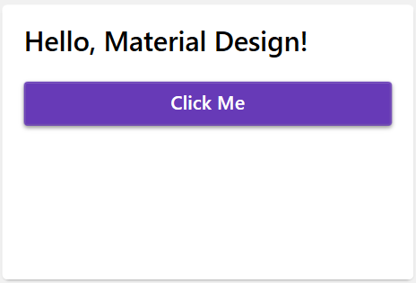

# Material Design in XAML v5.3.0 のインストール手順 （WPF / .NET Framework 4.8）

> Material Design in XAML は、WPF アプリケーションにマテリアルデザインの外観と操作感を提供するライブラリです。このドキュメントでは、Material Design in XAML v5.3.0 を .NET Framework 4.8 の WPF プロジェクトにインストールする手順を説明します。

> Official Site: https://github.com/MaterialDesignInXAML/MaterialDesignInXamlToolkit

## 1. NuGet パッケージをインストールする

Visual Studio でプロジェクトを開き、以下の手順で`Material Design Themes`パッケージを追加します。
合わせて`MaterialDesignColors`パッケージがインストールされます。

**手順**

1. プロジェクトを右クリック →「NuGet パッケージの管理」

2. 「参照」タブで`MaterialDesignThemes`を検索

3. バージョン 5.3.0 をインストール

4. **App.xaml** ファイルにMaterial Designテーマを適用を追加します。
   
   `xmlns:materialDesign="http://materialdesigninxaml.net/winfx/xaml/themes"` をStartupUriの上部に挿入します。
   
   ```html
    <Application [...]
        xmlns:materialDesign="http://materialdesigninxaml.net/winfx/xaml/theme"`
        StartupUri="MainWindow.xaml">
   ```
   
   <div class="page"/>

5. **App.xaml** ファイルにリソースディクショナリを追加します。
   
   ```html
      <Application.Resources>
          <ResourceDictionary>
              <ResourceDictionary.MergedDictionaries>
                  <materialDesign:BundledTheme BaseTheme="Light" PrimaryColor="DeepPurple" SecondaryColor="Lime" />
                  <ResourceDictionary Source="pack://application:,,,/MaterialDesignThemes.Wpf;component/Themes/MaterialDesign3.Defaults.xaml" />
              </ResourceDictionary.MergedDictionaries>
          </ResourceDictionary>
      </Application.Resources>
   ```

6. **MainWindow.xaml** ファイルにMaterial Designテーマを適用します。
   
   ```html
   <Window [...]        
          xmlns:materialDesign="http://materialdesigninxaml.net/winfx/xaml/themes"
          TextElement.Foreground="{DynamicResource MaterialDesignBody}"
          Background="{DynamicResource MaterialDesignPaper}"
          TextElement.FontWeight="Medium"
          TextElement.FontSize="14"
          FontFamily="pack://application:,,,/MaterialDesignThemes.Wpf;component/Resources/Roboto/#Roboto"
          [...] >
   ```

7. **MainWindow.xaml** ファイルにMaterial Designのコントロールを使用します。
   
   ```html
      <Grid>
          <materialDesign:Card Width="300" Height="200" Margin="16">
              <StackPanel Margin="16">
                  <TextBlock Text="Hello, Material Design!" 
                             Style="{StaticResource MaterialDesignHeadline6TextBlock}" 
                             Margin="0,0,0,16"/>
                  <Button Content="Click Me" 
                          Style="{StaticResource MaterialDesignRaisedButton}" />
              </StackPanel>
          </materialDesign:Card>
      </Grid>
   ```

8. プロジェクトをビルドして実行、以下のようにWPFにデザインが適用されていることを確認します。もしエラーで表示されない場合は、最初にビルドのクリーンを試みます。



> MaterialDesignThemes.Wpf.Packlconファイルまたはアセンプリ'MaterialDesignThemes.Wpf, Version=5.3.0.0, Culture=neutral, PublicKeyToken=df2a72020bd7962a'、
> またはその依存関係 の1つが読み込めませんでした。指定されたファイルが見つかりま せん。

上記のエラーが発生した場合は「5. <参考> エラー」の解決策を試みます。

## 2. アプリケーションのアイコンを設定する

## 2.1 Material Design Icons を利用する

アイコンに設定するPNGファイルを作成するか、以下のURLのアイコンを利用する。このURLはPNGファイルをダウンロードできる。

> [Material Design Icons - Icon Library - Pictogrammers](https://pictogrammers.com/library/mdi/)


ダウンロードしたPNGファイルは黒でありWindows11のタスクバーではアイコン画像が目立たないため、ペイント3Dなどで色を変更する。


アイコンにするPNGファイルを以下のサイトでICOファイルに変換、ICOファイルとしてダウンロードする。

[Convertio — ファイルコンバーター(無料)](https://convertio.co/ja/)

ダウンロードしたICOファイルをプロジェクトにコピーし、以下の手順でアプリケーションに設定する。

**手順**

1. プロジェクトを右クリック →「プロパティ」
2. アプリケーションの「アイコンとマニュフェスト」の**アイコン**にアイコンファイル(.ico)を選択して追加

WFPの画面上にもアイコンを表示したい場合は、以下の手順でアイコンファイルをプロジェクトに追加します。

1. プロジェクトを右クリック →「追加」→「既存の項目」

2. アイコンファイル（.ico）を選択して追加

3. 追加したアイコンをXAMLで表示します。
   
   ```html
    <Image Width="48" Height="48" Source="/Logo.ico"/>
   ```

## 3. ウィンドウのスタイルをカスタマイズする

XAMLでウィンドウのスタイルを以下のようにカスタマイズします。

```html
<Window [...]
        BorderThickness="1" ResizeMode="NoResize" WindowStyle="None"
          [...] >
```

## 4. <参考> エラー

> MaterialDesignThemes.Wpf.Packlconファイルまたはアセンプリ'MaterialDesignThemes.Wpf, Version=5.3.0.0, Culture=neutral, PublicKeyToken=df2a72020bd7962a'、
> またはその依存関係 の1つが読み込めませんでした。指定されたファイルが見つかりま せん。

上記のエラーが発生した場合は以下の解決策を試みます。

- bin / obj を削除してクリーンビルド
- Visual Studioのプロジェクトを閉じて再度起動
- MaterialDesignThemes の全パッケージを最新 5.x に統一
- App.xaml を v5 の BundledTheme に書き換え
- PackIcon を使っている XAML を一度コメントアウトしてビルド

# 改訂履歴

| Ver | 日付         | 作成者   | 変更内容   |
| --- | ---------- | ----- | ------ |
| 1.0 | 2026-01-03 | 上野 義和 | 初版リリース |
